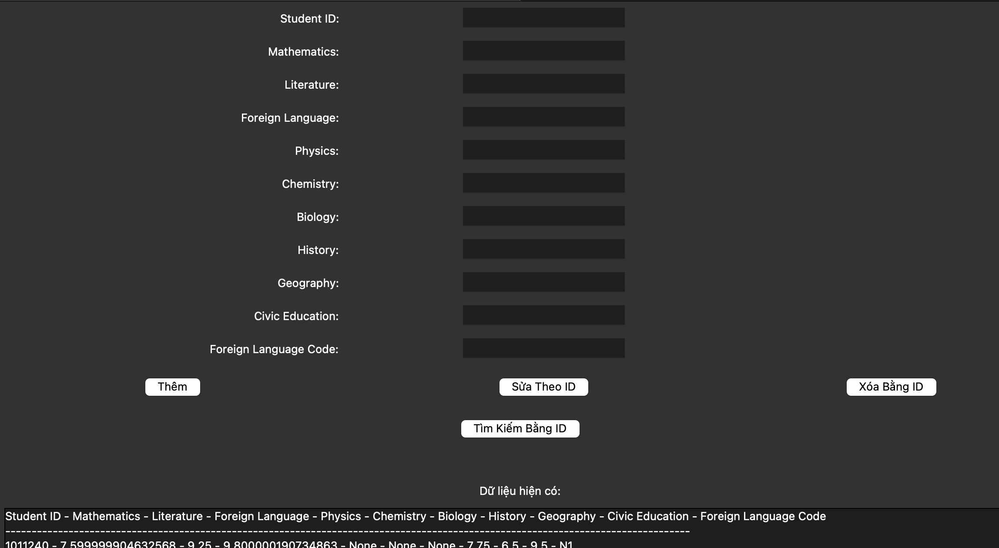

# A graduation exam score management system using Apache Spark and Cassandra

The graduation score management project integrates Apache Spark with Cassandra to process large distributed datasets across the Cassandra cluster.

The focused project aims to develop using Apache Spark's distributed system for executing queries, processing, and computations on large datasets. It utilizes the Tkinter interface for efficient user interaction.

## Requirement

- Python 3.8 and lates
- Apache Spark: <https://spark.apache.org/>
- Docker: <https://www.docker.com/>
- Apache Cassandra: <https://cassandra.apache.org/_/index.html>

### Download and set up ApacheSpark

Download full package [Spark](https://spark.apache.org/downloads.html)

or run the following command:

```Bash
pip install pyspark
```
Read <https://spark.apache.org/docs/latest/api/python/getting_started/install.html> to installation.

### Docker install
Dowload docker: <https://docs.docker.com/get-docker/>

### Install cassandra
**Note:** *Cassandra not support for windows, using docker to run cassandra and install driver Cassandra.*
```bash
pip install cassandra-driver
```

## Example programs

### Run Cassandra with docker

1. **Step 1.**
    Pull image cassandra

    ```bash
    docker pull cassandra:late
    ```

1. **Step 2.**
    Start Cassandra

    ```bash
    docker run --name Cassandra -p 9042:9042 -d cassandra
    ```

1. **Step 3.**
    Start a stadalone master

    ```bash
    spark-class org.apache.spark.deploy.master.Master
    ```

1. **Step 3.**
    Start one or more workers and connect to master

    ```bash
    spark-class org.apache.spark.deploy.worker.Worker spark://IP-master:7077
    ```

1. **Step 5:**
    Run the file `data_collect.py` to input dataframe data.

    ```ts
    # cqlsh
    Connected to Test Cluster at 127.0.0.1:9042
    [cqlsh 6.1.0 | Cassandra 4.1.4 | CQL spec 3.4.6 | Native protocol v5]
    Use HELP for help.
    cqlsh> DESC KEYSPACES;

    spark_add_data  system_auth         system_schema  system_views         
    system          system_distributed  system_traces  system_virtual_schema

    cqlsh> USE spark_add_data;
    cqlsh:spark_add_data> SELECT * FROM students LIMIT 50;

    student_id | biology | chemistry | civic_education | foreign_language | foreign_language_code | geography | history | literature | mathematics | physics
    ------------+---------+-----------+-----------------+------------------+-----------------------+-----------+---------+------------+-------------+---------
        1011240 |    null |      null |             9.5 |              9.8 |                    N1 |       6.5 |    7.75 |       9.25 |         7.6 |    null
        1009489 |    null |      null |            null |             null |                  null |      null |    4.75 |          7 |         3.6 |    null
    ```

    If it looks similar to what's above, single node cluster is operational!

1. **Step 6.**
    Run `app_cassandra.py` 
    

----
<div align=center>
    🐞 Good luck & Remember ';' 🐞
</div>